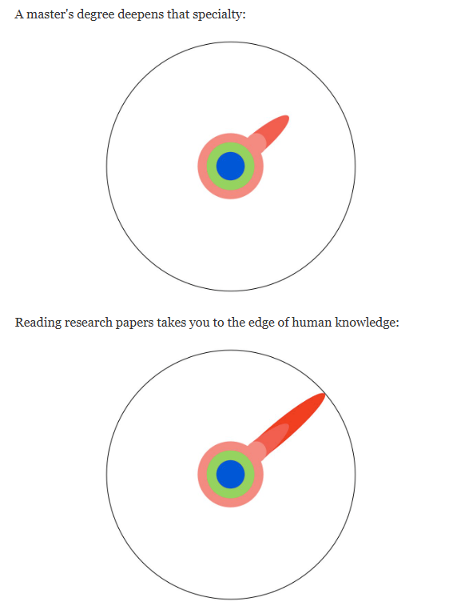
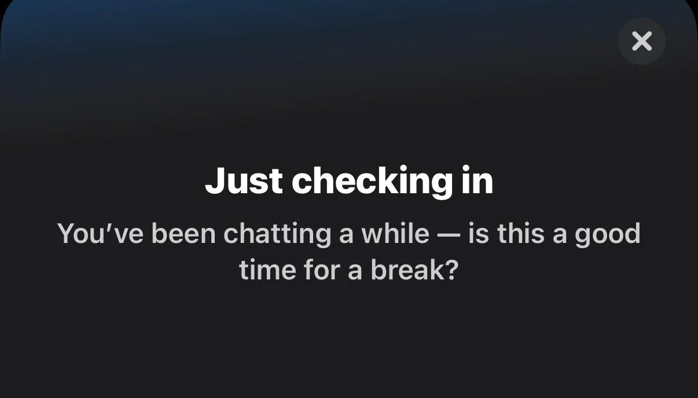

+++
title = "Before the PhD: Understanding the MS Thesis Journey"
date = "2025-10-02"
author = "Krish"
description = "There’s a lot of advice out there for PhD students — but what about those doing a research-based MS? Here’s what an MS thesis actually is, what people overlook, and how to figure out if research is really for you."
tags = ["gradschool", "research", "ms-thesis", "academic-life", "reflection"]
+++

---

  Please be nice — it’s still a draft, and yes, I’m procrastinating productively.

When I was looking for advice on getting into a research-based MS, I found plenty about PhDs but almost nothing about what a Master’s thesis actually feels like. This post is meant to fill that gap and give you a clearer picture of what the journey really looks like.

A lot of students who want hands-on research jump straight from **Bachelor’s to PhD**, while others go for a **coursework-only MS**. The **MS thesis** sits somewhere in between — not the most common route, and often misunderstood.

In this post, I want to share what I’ve learned about that middle ground — things I wish someone had explained when I was figuring it out.
I’ll talk about:

<!-- <a href="#what-led-me-to-give-up-on-my-own-thesis" class="link">What led me to give up on my own thesis</a>  -->

<ul style="list-style-type:'› '; margin:1rem 0; line-height:1.8; padding-left:1.2rem;">
  <li><a href="#what-an-ms-thesis-actually-is" class="link">What an MS thesis actually is</a></li>
  <li><a href="#what-a-good-approach-looks-like-for-getting-into-an-ms-thesis" class="link">What a good approach looks like for getting into an MS thesis</a></li>
  <li><a href="#the-stuff-people-often-overlook" class="link">The stuff people often overlook</a></li>
  <li><a href="#how-to-figure-out-if-research-and-maybe-a-phd-is-really-for-you" class="link">How to figure out if research (and maybe a PhD) is really for you</a></li>
</ul>

An MS thesis might look like a “mini PhD” on paper, but it’s really its own thing — a mix of structure and self-direction that tests how well you can explore and think independently.

If you’re planning to start one or already knee-deep in it, I hope this helps you see what to expect, what to avoid, and how to make the most of the experience.

---

<section id="what-an-ms-thesis-actually-is" style="margin-top: 3rem;">

  <h2 style="font-size:1.6rem; font-weight:700; margin-bottom:1rem; border-bottom:1px solid var(--border-color, #ddd); padding-bottom:0.25rem;">
    What an MS Thesis Actually Is
  </h2>

 

  Before we get into this, I'd like you to take a quick look at
  <a href="https://matt.might.net/articles/phd-school-in-pictures/"
     target="_blank"
     rel="noopener"
     class="link">
    The Illustrated Guide to a PhD
  </a>.
  Now, if you’ve gone through it, an MS thesis sits somewhere between those two last stages —
  deepening your specialty while giving you just enough of a push toward independent research.

<figure style="margin:1.5rem 0; text-align:center;">
  
</figure>

  It’s a research-based MS degree where you don’t just focus on high-level coursework but also apply what you learn in practice.
  Now that I’m doing my PhD, I can honestly say my MS thesis did feel like a “mini PhD,” but I don’t want that term to scare anyone off.
  It’s a rewarding experience that gives you a taste of both worlds — coursework and research. Personally, I’m glad I took this route instead of going straight from a bachelor’s to a PhD or doing a pure coursework MS.

  I was going to save this for later sections, but it makes sense to talk about some of the <strong>good sides</strong> of doing an MS thesis — the benefits.

If you successfully get into your MS thesis (I’ll call it <strong>MST</strong> from here on), here’s what you can expect:

<ul style="line-height:1.8; margin:1rem 0 1.5rem 1.5rem;">
  <li>
    <strong>First</strong>, you’ll likely have a position called <strong>Research Assistant</strong> (sounds fancy, right?).
    Hopefully, and usually your advisor will be able to support you financially — meaning your tuition, insurance, and even a monthly stipend are covered.
    This can vary depending on your school and state. In some cases, you might instead get a <strong>Teaching Assistant</strong> role, which still helps cover your costs.
    Either way, in most cases, you’ll find some form of support — though, like everything in grad school, there are exceptions.
  </li>
  <li>
    <strong>Second</strong>, there will be <strong>less coursework</strong>.
    I know you might question me for calling that a good thing (it is, at least for me and my peers).
    It gives you the space to dive into research without feeling overloaded by classes.
  </li>
  <li>
    <strong>Third</strong>, if you’re a <strong>working professional</strong> and just want to deepen your specialty,
    there wouldn’t be a better match than this.
    You get to focus on your field, apply it in practice, and still get a glimpse of your college days — well, at least part of it.
  </li>
</ul>

  Doing an MS thesis isn’t just about finishing a project — it’s about learning how to think, explore, and figure things out on your own.

  So now that you have a sense of what an MST actually is, the next question is:
  <strong>how do you get into one, and what makes for a good approach?</strong>

<section id="what-a-good-approach-looks-like-for-getting-into-an-ms-thesis" style="margin-top:3rem;">

  <h2 style="font-size:1.6rem; font-weight:700; margin-bottom:1rem; border-bottom:1px solid var(--border-color,#ddd); padding-bottom:0.25rem;">
    What a Good Approach Looks Like for Getting into an MS Thesis
  </h2>

  

    Okay, so let’s say you’ve decided you want to do an MST.
    Now comes the part no one really explains — <em>how do you actually get into one?</em>
  

  

    Unlike coursework programs where you just apply, get in, and pick classes,
    a thesis-based MS depends a lot on <strong>finding an advisor</strong> and
    <strong>aligning your interests</strong>. That part usually starts
    <em>way earlier</em> than most people think.
  

  
Maybe we can call this <strong>Stage 0</strong> — before everything else.

  <h3 style="font-size:1.25rem; margin-top:2rem; font-weight:600;">Picking a Research Interest</h3>

  

    I’ve always believed the most important thing is knowing what you <strong>don’t</strong> want to do.
    I tend to think practically — what’s current, where the field’s heading, and what feels like a good, realistic bet.
    It’s not the most romantic way to pick a topic, but it worked for me.
  

  

    If you’re someone who follows curiosity more than planning, I’d recommend checking out
    <a href="https://lennartnacke.substack.com/i/149604218/follow-your-interests"
       target="_blank" rel="noopener" class="link">
      “How to Pick a Research Topic (and Actually Love It)” by Lennart Nacke, PhD
    </a>.
    It’s written for PhD students, but it applies perfectly to anyone starting research.
    Here’s the short version I liked:
  

  <ul style="line-height:1.8; margin:1rem 0 1.5rem 1.5rem;">
    <li>
      <strong>Follow what actually interests you.</strong>
      Don’t pick something because it looks impressive — pick what you genuinely enjoy learning about.
    </li>
    <li>
      <strong>Read just enough to see what’s hot.</strong>
      Don’t overthink the topic too early — it’s a momentum thing.
      Ideas won’t magically appear while you’re relaxing; they show up when you’re exploring and trying stuff.
    </li>
    <li>
      <strong>Keep it realistic.</strong>
      Cool ideas are great, but practicality matters.
      Make sure you’ve got the time, tools, and support to actually get somewhere with it.
    </li>
  </ul>

  

  <h3 style="font-size:1.25rem; margin-top:1rem; font-weight:600;">Finding the Right Advisor</h3>

  

    Once you’ve got a direction, the next step is finding the person who’ll guide you — and that’s where things get real.
  

<ul style="line-height:1.8; margin:1rem 0 1.5rem 1.5rem;">
  <li>
    <strong><a href="#start-early" class="link">Start early.</a></strong>
    Don’t wait until you’re admitted to look for professors. Browse your department’s site,
    check who’s working on topics that seem interesting, and note down potential matches.
    I explain this in more detail just below — it’s probably the most useful step to get right early.
  </li>
  <li>
    <strong>Find alignment.</strong>
    Focus on how your goals and working style fit with theirs. Some professors are very hands-on,
    others prefer independent students — neither is better, but the fit matters.
  </li>
  <li>
    <strong>Talk to students if you can.</strong>
    They’ll tell you what the lab is actually like — how often people meet, how supportive the advisor is,
    and whether the environment matches what you’re looking for.
  </li>
</ul>

  <h3 style="font-size:1.25rem; margin-top:2rem; font-weight:600;">Start Early</h3>

  

    This part tends to confuse people, but it’s simple once you break it down.
  

  <ol style="line-height:1.8; margin:1rem 0 1.5rem 1.5rem;">
    <li>
      <strong>Check who’s hiring.</strong>
      Go through your department or research group pages. Most professors (especially in CS)
      have their own sites where they mention if they’re looking for MS/PhD students.
      Even if nothing’s listed, it doesn’t hurt to ask — some just don’t update their sites.
    </li>
    <li>
      <strong>Do a bit of homework.</strong>
      Look them up on Google Scholar and skim a few of their recent papers — maybe from 2023–2025.
      You don’t have to understand everything, just get a sense of the kind of problems they’re working on.
      If you’re new to reading papers,
      <a href="https://cseweb.ucsd.edu/~wgg/CSE210/howtoread.html" target="_blank" rel="noopener" class="link">
        “How to Read an Engineering Research Paper”
      </a> is a great start.
    </li>
    <li>
      <strong>Reach out properly.</strong>
      Remember, professors are going to invest their time and funding in you,
      so first impressions matter. Keep your message short, specific, and personal.
      Here’s a clean version of what I used:
    </li>
  </ol>

  <pre style="background:var(--background-fg,#f7f7f7);
              color:var(--primary-color,#333);
              padding:1rem; border-radius:6px;
              border:1px solid var(--border-color,#ddd);
              white-space:pre-wrap;
              font-family:var(--ff-code,monospace);
              font-size:0.95rem;">

Dear Dr. [Last Name],

I introduce myself as [Your Full Name], and I recently completed my Bachelor's in [Your Major] at [Your University, Country].

I’ve applied for the Master’s (Thesis) program in [Department Name] at [Target University], and I’m particularly interested in your work on “[Paper or Topic Name].”
From what I’ve read, your research on [specific topic or problem] aligns well with my experience in [relevant area or skills].

Currently, I’m working as [your current position or project], where I’ve been gaining hands-on experience in [relevant tech or research area].
With my background in [specific field], I believe I could contribute meaningfully to your group.

I’ve attached my CV and transcript for your reference. If you’re open to meeting, I’d love to discuss potential opportunities.

Thank you for your time.

Best,
[Your Name]
[Your Email]
[Your LinkedIn or Website (optional)]
  </pre>

  <ol start="4" style="line-height:1.8; margin:1rem 0 1.5rem 1.5rem;">
    <li>
      <strong>Be ready to talk.</strong>
      If they’re interested, you might get a short meeting or chat.
      You don’t have to “pitch” yourself — just be genuine and prepared for a few questions like:
      <ul>
        <li>Why this professor or lab?</li>
        <li>Why a thesis instead of coursework-only?</li>
        <li>What kind of problems do you like working on?</li>
        <li>Would you consider a PhD later? (It’s fine to say yes — it shows openness.)</li>
      </ul>
      Think of it like a normal conversation, not an interview.
    </li>
  </ol>

 

  You’re not just applying to a program — you’re choosing the person and place that’ll shape how you see research.

<section style="margin:4rem auto; display:flex; justify-content:center;">
  

    
    

      🐇 That’s all for tonight — ChatGPT told me to take a break. 
      More words soon, promise.
    

  

</section>

</section>

<!-- ## write about students perks liek free gemini ai and spotifys amazona dn stuff -->
